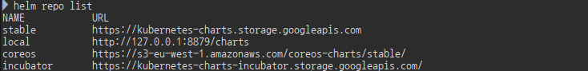
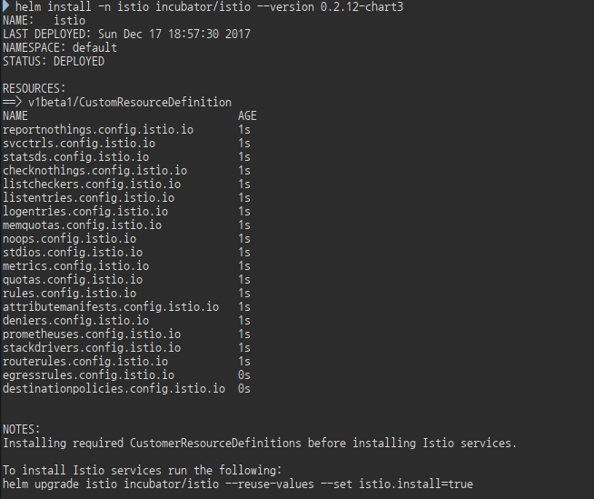
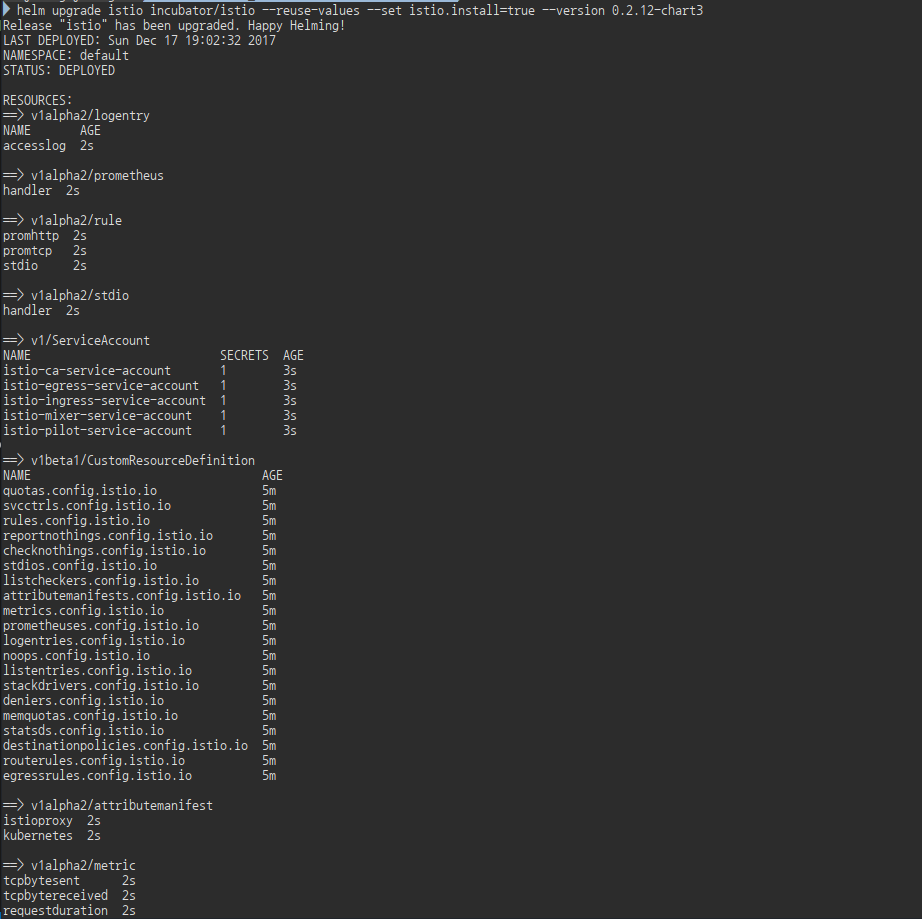
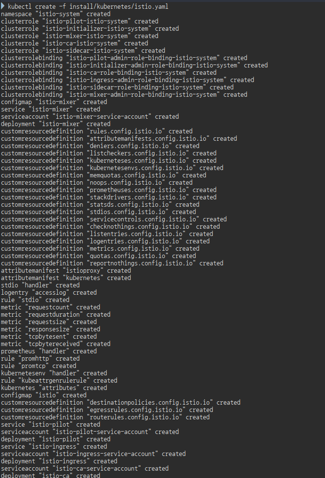
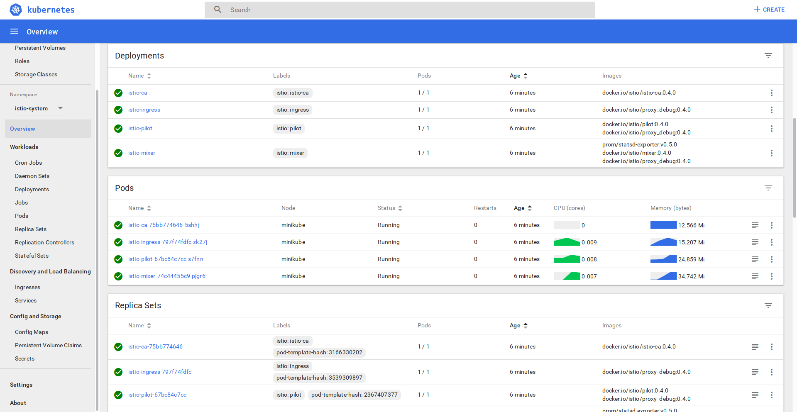
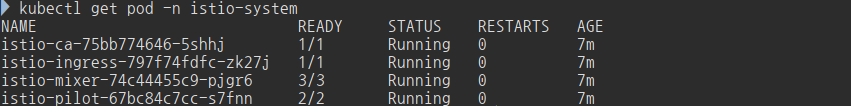

# Istio
how to run the Istio Ingress Controller in a Kubernetes Cluster.

## Architecture

  - Istio Pilot managed by a Deployment
  - Istio Ingress Controller managed by a DaemonSet
    - Runs on each node in dedicated Istio Ingress node pool
  - Frontend Load Balancer distributes traffic across multiple Istio Ingress Controllers
## Tutorials
### Install Client Tools
- kubectl
- [istioctl](https://github.com/istio/istio/releases) v0.4 (2017.12.16)

- download istio tool, doc and samples
  ```bash
    curl -L https://git.io/getLatestIstio | sh -
  ```
  * 현재 위의 스크립트를 실행하면 v0.3.0을 다운로드 한다
  * 만약 최신버전인 v0.4를 사용할려면, getLatestIstio를 받아서 ISTIO_VERSION을 0.4.0로 수정하고 sh을 실행한다

<!-- 
Kubernetes 1.7.3 or newer cluster with RBAC(Role-Based Access Control) - enabled -->

<!-- Minikube
- Grant Cluster Admin Permissions to the current User
  Admin permissions are required to create the necessary RBAC rules for the Istio Pilot and Ingress Controller:
  ```bash
  kubectl create clusterrolebinding cluster-admin-binding \
    --clusterrole=cluster-admin \
    --user=$(gcloud config get-value core/account)
  ``` -->

### Install istio with helm
```bash
# incubator repo 추가
helm repo add incubator http://storage.googleapis.com/kubernetes-charts-incubator

# install the istio 
helm install -n istio incubator/istio --version 0.2.12-chart3
```


```bash
# CustomResourceDefinition이 없는 경우, CRD를 먼저 생성한다. 그 다음 다시 아래 명령어를 실행한다.
helm upgrade istio incubator/istio --reuse-values --set istio.install=true
```

### Install istio with kubectl
<!-- 
### Grant Permissions
```bash
# kubernetes api version을 확인한다.
kubectl api-versions | grep rbac

# if you have alpha version, run:
kubectl apply -f install/kubernetes/istio-rbac-alpha.yaml

# if you have beta version, run:
kubectl apply -f install/kubernetes/istio-rbac-beta.yaml
``` -->
```
kubectl create -f install/kubernetes/istio.yaml
```
> mutual TLS를 사용할때는 
> ```bash
> kubectl create -f install/kubernetes/istio-auth.yaml
> ```



- istio pods
  ```bash
  kubectl get pod -n istio-system
  ```
  

### Using Istio Route Rules

  - istio-initializer가 설치되어 있는 경우, 일반적인 방법으로 app을 설치하면 자동으로 istio sidecar가 설치된다
    - istio-initializer 설치
      ```bash
      kubectl create -f install/kubernetes/istio-initializer.yaml
      ```
  
  - 하지만 그렇지 않은 경우, 아래와 같이 app을 설치한다
    ```bash
    kubectl create -f <(istioctl kube-inject -f <your-app-spec>.yml)
    ```