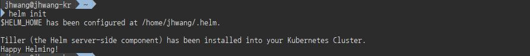
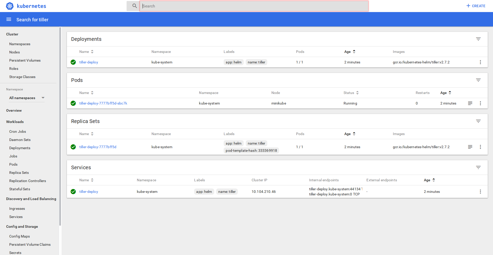
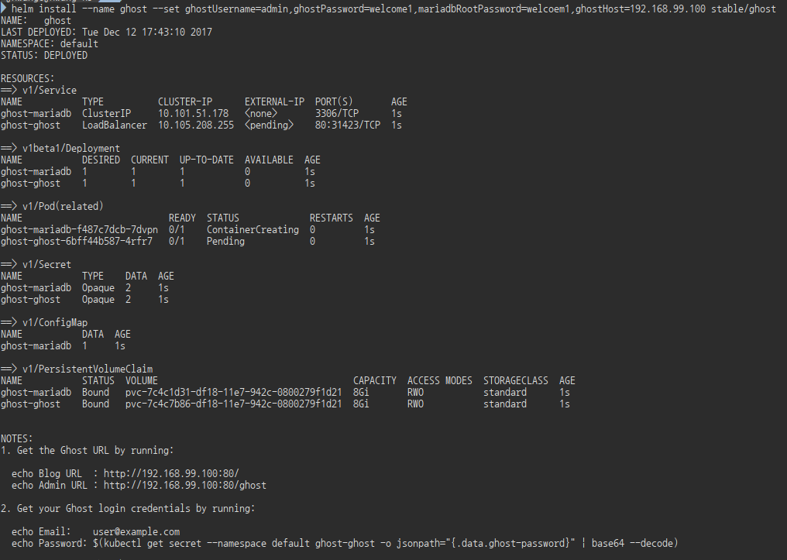

# Oracle Montly Meetup - Hands-on : Kubernetes
- 2017년12월16일
- @jupil_hwang

### Prerequisites
- Virtualbox
- minikube
- kubectl

**설치가이드**
- Install Docker & Kubernetes -  https://goo.gl/4PHTJt

#### Minikube Installation
참고 URL : [https://github.com/kubernetes/minikube]()
각 OS에 맞게 설치하면 됩니다.

  ##### Windows 사용자
  Download the [minikube-windows-amd64.exe](https://storage.googleapis.com/minikube/releases/latest/minikube-windows-amd64.exe) file, rename it to minikube.exe and add it to your path.

//chocolatey (Package Manager for Windows)를 사용하면 편리하게 설치할 수 있다.
###### chocolatey 설치
```powershell
Set-ExecutionPolicy Bypass -Scope Process -Force; iex ((New-Object System.Net.WebClient).DownloadString('https://chocolatey.org/install.ps1'))
```
###### install kubectl with chocolatey
```
choco upgrade chocolatey
choco version
choco list kubernetes-cli       //check its version
choco install kubernetes-cli    
choco upgrade kubernetes-cli    //in case you want to upgrade
choco list --localonly 
```

##### Mac OS 사용자
```
brew cask install minikube
```
##### Linux 사용자
```
curl -Lo minikube https://storage.googleapis.com/minikube/releases/latest/minikube-linux-amd64 && chmod +x minikube && sudo mv minikube /usr/local/bin/
```
---
### Kubernetes 101 (in 3min)
- Node : Master Node / Worker Node
- Pod :
- Service :
- Deployment :
- Ingress :

---
### Helm
Helm은 Kubernetes Package Manager이다. 크게 두개 파트로 구성이 되어 있다. Client tool인 Helm과 Server tool인 Tiller로 구성된다. Tiller는 kubernetes Cluster안에서 서비스로 동작하며, charts의 관리(설치/제거/관리)를 담당한다. Helm은 Client인 laptop이나 CI/CD에서 동작하는 CLI이다.

- chart : Kubernetes에 탑재되는 Helm Package이다.
  - 두개 파트로 구성되어 있다. 
    - chart.yaml : 패키지의 설명
    - 하나이상의 Kubernetes Tempalte들 (kubernetes manifest files)
  - [Chart](https://github.com/kubernetes/charts)
  - [Kubeapps](https://kubeapps.com/)

- 설치
  - K8s context 확인
    현재 Kubeconfig의 current-context가 helm을 설치할려고 하는 K8s cluster를 가르키고 있는지 확인한다.
    ```
    kubectl config current-context
    ```
    cluster가 여러개인 경우 환경변수에 KUBECONFIG을 따로 설정할 수 있다.
  - tiller 설치
    ```bash
    helm init
    ```
    
    
  - 업그레이드를 원할때는 아래와 같이 하면 된다.
    ```
    helm init --upgrade
    ```
- Example 설치
  - nginx 패키지 검색 및 설치
    ```
    helm search ghost
    ```
    ```
    helm install stable/ghost 
    ```
    or
    ```
    helm install --name ghost --set ghostUsername=admin,ghostPassword=welcome1,mariadbRootPassword=welcoem1 stable/ghost
    ```
    
  - 외부 저장소 추가
    ```
    helm repo add coreos https://s3-eu-west-1.amazonaws.com/coreos-charts/stable/
    ```
<!-- 
### Kubernetes  Navigator
- 요청된 호스트에 따라 내부 DNS를 이용하여, Proxy Passing하는 Nginx Service
 -->

### Minikube Ingress 
Kubernetes에서 Service의 외부접근을 처리한다. (L7처럼 동작)
- minikube 1.4+ 에서는 addon으로 nginx ingress를 제공한다
  ```
  minikube addons enable ingress
  ```
  - a configMap for Nginx loadbalancer
  - the Nignx Ingress Controller
  - a Service that exposes a default Nginx backend pod for handling unmapped requests
- The layout of our cluster for this demo is:
  - A backend that will receive requests for myminikube.info and displays some basic information about the cluster and the request.
  - A pair of backends that will receive the request for cheeses.all .One whose path begins with /stilton and another whose path begins with /cheddar

##### Let's setup the echoserver


### Kube-lego
Kube-Lego는 Kubernetes Ingress에서 Let's Encrypt인증서를 생성하고 자동으로 갱신해 주는 툴이다. Helm으로 설치가 가능하다

###### setup
  ```
  helm init
  ```

##### install nginx-ingress
ingress를 설정하기 전에우선 ingress-controller를 설치해야 한다.

  ```
  helm install --name nginx-ingress stable/nginx-ingress
  ```

##### install kube-lego
```
helm install --name kube-lego --set config.LEGO_EMAIL=jupil.hwang@gmail.com,config.LEGO_URL=https://acme-v01.api.letsencrypt.org/directory stable/kube-lego
```

```log
helm install --name kube-lego --set config.LEGO_EMAIL=jupil.hwang@gmail.com,config.LEGO_URL=https://acme-v01.api.letsencrypt.org/directory stable/kube-lego
NAME:   kube-lego
LAST DEPLOYED: Sun Dec 10 12:02:15 2017
NAMESPACE: default
STATUS: DEPLOYED

RESOURCES:
==> v1beta1/Deployment
NAME                 DESIRED  CURRENT  UP-TO-DATE  AVAILABLE  AGE
kube-lego-kube-lego  1        0        0           0          0s

==> v1/Pod(related)
NAME                                  READY  STATUS             RESTARTS  AGE
kube-lego-kube-lego-5fc45594ff-sdxld  0/1    ContainerCreating  0         0s


NOTES:
This chart installs kube-lego to generate TLS certs for Ingresses.

EXAMPLE INGRESS YAML:

apiVersion: extensions/v1beta1
kind: Ingress
metadata:
  name: example
  namespace: foo
  annotations:
    kubernetes.io/ingress.class: nginx
    # Add to generate certificates for this ingress
    kubernetes.io/tls-acme: 'true'
spec:
  rules:
    - host: www.example.com
      http:
        paths:
          - backend:
              serviceName: exampleService
              servicePort: 80
            path: /
  tls:
    # With this configuration kube-lego will generate a secret in namespace foo called `example-tls`
    # for the URL `www.example.com`
    - hosts:
        - "www.example.com"
      secretName: example-tls
```

---
### Prometheus Installation with Helm
```bash
helm repo add coreos https://s3-eu-west-1.amazonaws.com/coreos-charts/stable/

helm install coreos/prometheus --name prometheus
```
