# Hands-on : Kubernetes 이어서...
# Prerequisites
- Virtualbox
- minikube
- kubectl

**설치가이드**
- Install Docker & Kubernetes -  https://goo.gl/4PHTJt by younggyu.kim@oracle.com / credemol@gmail.com

<!--
#### Minikube Installation
참고 URL : [https://github.com/kubernetes/minikube]()
각 OS에 맞게 설치하면 됩니다.

  ##### Windows 사용자
  Download the [minikube-windows-amd64.exe](https://storage.googleapis.com/minikube/releases/latest/minikube-windows-amd64.exe) file, rename it to minikube.exe and add it to your path.

  //chocolatey (Package Manager for Windows)를 사용하면 편리하게 설치할 수 있다.
  ###### chocolatey 설치
  ```powershell
  Set-ExecutionPolicy Bypass -Scope Process -Force; iex ((New-Object System.Net.WebClient).DownloadString('https://chocolatey.org/install.ps1'))
  ```

  ###### install kubectl with chocolatey
  ```bash
  choco upgrade chocolatey
  choco version
  choco list kubernetes-cli       //check its version
  choco install kubernetes-cli    
  choco upgrade kubernetes-cli    //in case you want to upgrade
  choco list --localonly 
  ```

  ##### Mac OS 사용자
  ```
  brew cask install minikube
  ```
  ##### Linux 사용자
  ```
  curl -Lo minikube https://storage.googleapis.com/minikube/releases/latest/minikube-linux-amd64 && chmod +x minikube && sudo mv minikube /usr/local/bin/
-->

# Kubernetes 101 (in 3min)
- Node : Master Node / Worker Node
- Cluster
- Namespace
- Pod : one or more containers in a pod, share same IP address and resource (mount, host etc..)
- Service
- Labels
- Deployment : replicaset, replication controller
- Ingress
- configMap

<!--
**kube-dns DNS Schema 규칙**
서비스의 경우, <서비스이름>.<네임스페이이름>.svc.cluster.local
pod의 경우, <팟-IP-Address>.<네임스페이스이름>.pod.cluster.local
- pod의 IP Address가 1.2.3.4인 경우 1-2-3-4.default.pod.cluster.local
-->


<!-- 
### Kubernetes  Navigator
- 요청된 호스트에 따라 내부 DNS를 이용하여, Proxy Passing하는 Nginx Service
 -->

# Kubernetes Tutorial

** 아래의 실습 환경은 minikube start --memory 4096 or 8192 --extra-config=apiserver.Authorization.Mode=RBAC 로 실행하면, 좀 더 친절한 환경에서 할 수 있다. **

### Let's setup the echoserver
```bash
# Docker hub에 등록되어 있는 googlecontainer/echoserver를 실행
kubectl run echoserver --image=googlecontainer/echoserver:1.7 --port=8080

# 서비스를 생성
kubectl expose deployment echoserver --type=NodePort
or
#kubectl expose deployment echoserver

# Pod list 확인
kubectl get pod,svc

# 네임스페이스를 명시해서 해당하는 네임스페이스의 리소스들만 볼 수 있다.
#kubectl get pod -n kube-system
# or
#kubectl get pod --namespace=kube-system

# scale up 
kubectl scale deployments echoserver --replica=3

# scale 된 pod 확인
kubectl get pod,svc

# Viewing, Finding Resources
kubectl describe pod <podname>
```
- minikube에서는 아래와 같은 방법으로도 service를 확인할 수 있다.
```bash
minikube service list
```
- advanced : kubectl expose가 어떻게 동작하는지 알고 싶다면 .
```bash
# kubectl expose 전
minikube ssh "iptables --list"

kubectl expose ......

minikube ssh "iptables --list"
```

# Ingress
### Minikube Ingress 
- service를 ClusterIP로 만들었을때, 외부에서 서비스에 접근하고 싶을때는 어떻게 하면 될까요?
  - kubectl port-forward <pods이름> 로컬호스트포트:서비스외부포트
  - ingress 설정 : Kubernetes에서 Service의 외부접근을 처리한다. (L7처럼 동작)
- minikube 1.4+은 addon으로 ingress를 제공한다
  ```
  minikube addons enable ingress
  ```
  아래와 같은 것들을 만들어 준다
  - a configMap for Nginx loadbalancer
  - the Nignx Ingress Controller
  - a Service that exposes a default Nginx backend pod for handling unmapped requests
  ```bash
  kubectl get all -n kube-system
  ```
- The layout of our cluster for this demo is:
  - A backend that will receive requests for myminikube.local and displays some basic information about the cluster and the request.
  - A pair of backends that will receive the request for cheeses.all .One whose path begins with /stilton and another whose path begins with /cheddar


### ingress rule 설정
- [ingress-rule.yml]
  ```yaml
  apiVersion: extensions/v1beta1
  kind: Ingress
  metadata:
    name: ingress-tutorial
    annotations:
      ingress.kubernetes.io/rewrite-target: /
  spec:
    backend:
      serviceName: default-http-backend
      servicePort: 80
    rules:
    - host: myminikube.local
      http:
        paths:
        - path: /
          backend:
            serviceName: echoserver
            servicePort: 8080
  ```
- ingress rules를 등록한다.
  ```bash
  kubectl create -f ingress-rule.yml
  # or
  kubectl create -f https://raw.githubusercontent.com/namoo4u/meetup_k8s_1216/master/ingress-rule.yml
  ```
- 등록된 ingress를 확인한다.
  ```
  kubectl describe ing ingress-tutorial
  ```
- host 파일에 myminikube.local 를 등록한다
  ```bash
  # for linux or mac os desktop
  echo "$(minikube ip) myminikube.local" >> /etc/hosts

  # for windows desktop
  # %systemroot%\system32\drivers\etc\hosts
  ```
- service에 접속해 본다.
  ```bash
  watch curl -sSL myminikube.local
  # or
  # open browser and refresh
  ```
<!--
### Kube-lego
Kube-Lego는 Kubernetes Ingress에서 Let's Encrypt인증서를 생성하고 자동으로 갱신해 주는 툴이다. Helm으로 설치가 가능하다
ACME protocol : Automated Certificate Management Environment protocol


[출처 : https://blog.jetstack.io/blog/kube-lego/]

##### install kube-lego
```
helm install --name kube-lego --set config.LEGO_EMAIL=jupil.hwang@gmail.com,config.LEGO_URL=https://acme-v01.api.letsencrypt.org/directory stable/kube-lego
```

```yml
helm install --name kube-lego --set config.LEGO_EMAIL=jupil.hwang@gmail.com,config.LEGO_URL=https://acme-v01.api.letsencrypt.org/directory stable/kube-lego
NAME:   kube-lego
LAST DEPLOYED: Sun Dec 10 12:02:15 2017
NAMESPACE: default
STATUS: DEPLOYED

RESOURCES:
==> v1beta1/Deployment
NAME                 DESIRED  CURRENT  UP-TO-DATE  AVAILABLE  AGE
kube-lego-kube-lego  1        0        0           0          0s

==> v1/Pod(related)
NAME                                  READY  STATUS             RESTARTS  AGE
kube-lego-kube-lego-5fc45594ff-sdxld  0/1    ContainerCreating  0         0s


NOTES:
This chart installs kube-lego to generate TLS certs for Ingresses.

EXAMPLE INGRESS YAML:

apiVersion: extensions/v1beta1
kind: Ingress
metadata:
  name: example
  namespace: foo
  annotations:
    kubernetes.io/ingress.class: nginx
    # Add to generate certificates for this ingress
    kubernetes.io/tls-acme: 'true'
spec:
  rules:
    - host: www.example.com
      http:
        paths:
          - backend:
              serviceName: exampleService
              servicePort: 80
            path: /
  tls:
    # With this configuration kube-lego will generate a secret in namespace foo called `example-tls`
    # for the URL `www.example.com`
    - hosts:
        - "www.example.com"
      secretName: example-tls
```

```yml
apiVersion: extensions/v1beta1
kind: Ingress
metadata:
  name: hello-world
  annotations:
    # enable kube-lego for this ingress
    kubernetes.io/tls-acme: "true"
spec:
  # this enables tls for the specified domain names
  tls:
  - hosts:
    - demo.kube-lego.jetstack.net
    secretName: hello-world-tls
  rules:
  - host: demo.kube-lego.jetstack.net
    http:
      paths:
      - path: /
        backend:
          serviceName: hello-world
          servicePort: 80
```
-->

# Helm
Helm은 Kubernetes Package Manager이다. 크게 두개 파트로 구성이 되어 있다. Client tool인 Helm과 Server tool인 Tiller로 구성된다. Tiller는 kubernetes Cluster안에서 서비스로 동작하며, charts의 관리(설치/제거/관리)를 담당한다. Helm은 Client인 laptop이나 CI/CD에서 동작하는 CLI이다.

- chart : Kubernetes에 탑재되는 Helm Package이다.
  - 두개 파트로 구성되어 있다. 
    - chart.yaml : 패키지의 설명
    - 하나이상의 Kubernetes Tempalte들 (kubernetes manifest files)
  - [Chart](https://github.com/kubernetes/charts)
  - [Kubeapps](https://kubeapps.com/)

- 설치
  - K8s context 확인
    현재 Kubeconfig의 current-context가 helm을 설치할려고 하는 K8s cluster를 가르키고 있는지 확인한다.
    ```
    kubectl config current-context
    ```
    cluster가 여러개인 경우 환경변수에 KUBECONFIG을 따로 설정할 수 있다.
  - tiller 설치
    ```bash
    helm init
    ```
    
    
  - 업그레이드를 원할때는 아래와 같이 하면 된다.
    ```
    helm init --upgrade
    ```
- Example
  - nginx 패키지 검색 및 설치
    ```bash
    helm search mysql
    helm install stable/mysql
    ```
  - 외부 저장소 추가
    ```
    helm repo add coreos https://s3-eu-west-1.amazonaws.com/coreos-charts/stable/
    helm repo add incubator https://kubernetes-charts-incubator.storage.googleapis.com/
    ```

# Monitoring

source : https://www.datadoghq.com/blog/how-to-collect-and-graph-kubernetes-metrics/


### cAdvisor / kubelet
- kubelet소스 코드안에 cAdvisor api가 들어가 있다. [github source](https://github.com/kubernetes/kubernetes/tree/release-1.7/pkg/kubelet/server/stats)

```bash
kubectl proxy &
curl localhost:8001/api/v1/nodes/$(kubectl get nodes -o=jsonpath="{.items[0].metadata.name}")/proxy/stats/

curl localhost:8001/metrics
```

https://www.outcoldman.com/en/archive/2017/07/09/kubernetes-monitoring-resources/

### Heapster 를 이용한 Kubernetes Monitoring
- Container Cluster Monitoring and Performance Analysis
<!---->


- influxdb & grafana
  - Heapster collects and interprets various signals like compute resource usage, lifecycle events, etc. Note that the model API, formerly used provide REST access to its collected metrics, is now deprecated. Please see the model documentation for more details.
- in minikube
  ```bash
  minikube addons enable heapster

  minikube service list
  ```
  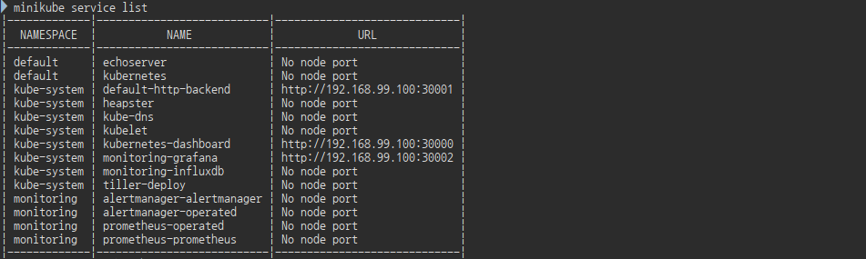
  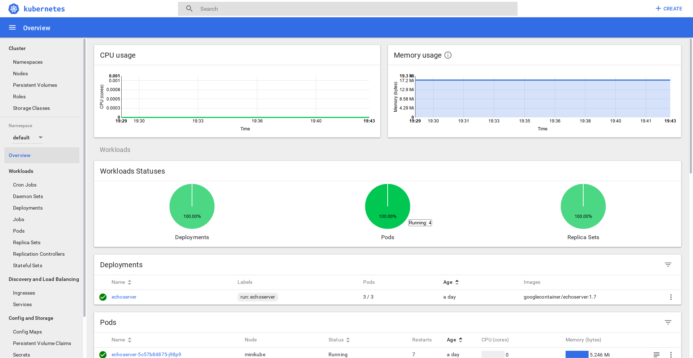
  <heapster가 적용된 Kubernetes dashboard>

- heapster model metrics
  ```bash
  kubectl port-forward -n kube-system $(kubectl get pods --selector=k8s-app=heapster -n kube-system --output=jsonpath="{.items..metadata.name}") 8082
  ```
  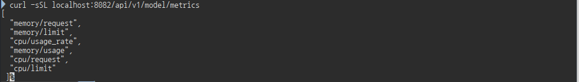
<!-- <- browse to http://localhost:8082 -->

- grafana
```bash
kubectl port-forward -n kube-system influx-grafana 3000
```   


### Prometheus를 이용한 Kubernetes Monitoring
#### Prometheus
Google Borgmon에서 영감을 받아서 만들게 된, Monitor/alert을 위한 오픈소스 툴이다. Soundcloud에서 처음(2012)에 만들어지다가, 2015년 발표, 현재는 CNCF에서 관리하고 있다. 다양한 Client언어와 Platform을 지원하며, PostgreSQL, MySQL, Etcd 등과 연결할 수 있는 Exporters를 제공한다.

- Monitoring system and TSDB
  - Instrumentation
  - Metrics collection and storage
  - Querying, alerting, dashboarding

- collects metrics at scale via HTTP (think:yet another client of your microservice)
- thousands of targets, millions of time series, 800k samples/s, no dependencies
- easy to scale
- powerfull query language (PromQL)
  - New query language
  - Greate for time series computations
  - Not SQL-style, but functional
  ```javascript
  // the 3 path-method combinations with the hightest number of failing requests?
  topk(3, sum by(path, method)) (
    rate(http_requests_totla{status=~"5.."}[5m])
  )

  // All partiitions in my entire infra with more than 100GB capacity that are not mounted on root?
  node_filesystem_bytes_total{mountpoint!="/"}
  ```

Coreos에서는 K8s환경에서 사용할 수 있는 다양한 Operators를 출시했는데, 그 중에는 오픈소스인 [Prometheus-Operator](http://github.com/coreos/prometheus-operator)도 있다.

**참고** 다양한 Kubernetes Extensions : https://github.com/coreos/awesome-kubernetes-extensions
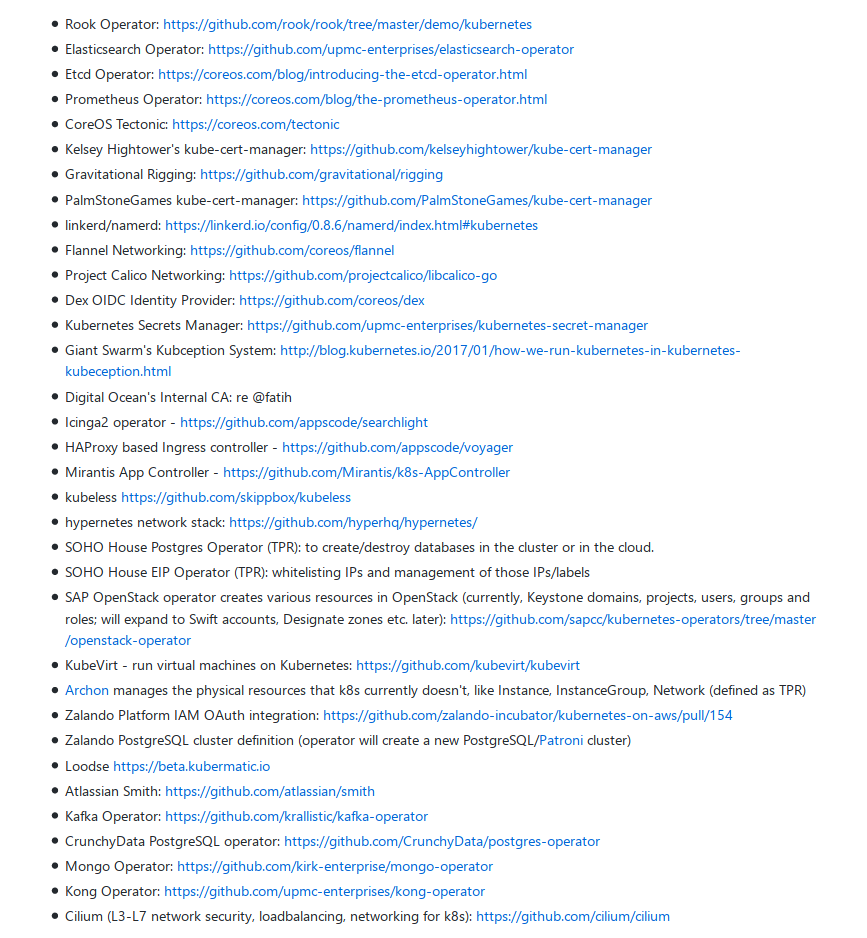

##### How does it works?
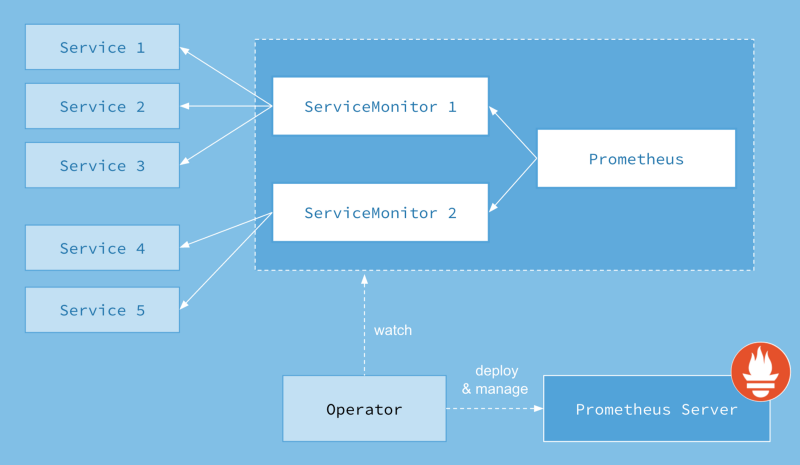

source: [Prometheus-operator](https://coreos.com/blog/the-prometheus-operator.html)

**주의**
minikube에서 helm으로 설치할 때는 Authorization에서 rbac을 사용
```bash
minikube start --extra-config=apiserver.Authorization.Mode=RBAC

# node 기동 확인 후, node status가 READY가 되는 것을 확인한다
kubectl get nodes

# minikube-rbac 설치
kubectl apply -f https://raw.githubusercontent.com/coreos/prometheus-operator/master/scripts/minikube-rbac.yaml
```
```bash
# coreos chart repo 추가
helm repo add coreos https://s3-eu-west-1.amazonaws.com/coreos-charts/stable/

# monitoring namespace 생성
#kubectl create ns monitoring

# Prometheus-operator 설치
helm install --name prometheus-operator --set rbacEnable=enable --namespace=monitoring coreos/prometheus-operator

# pod과 crd(CustomResourceDefinition)을 확인해 보자
kubectl get pod,crd -n monitoring
```
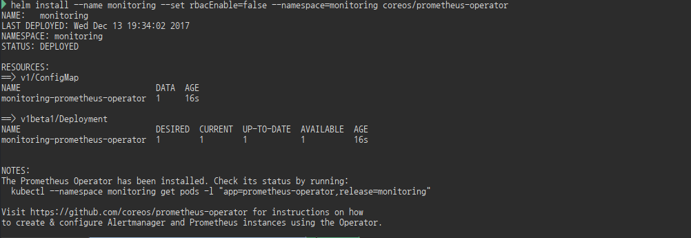
```bash
# prometheus, alertmanager and grafana 설치
helm install --name prometheus --set serviceMonitorsSelector.app=prometheus --set ruleSelector.app=prometheus --namespace=monitoring coreos/prometheus
helm install --name alertmanager --namespace=monitoring coreos/alertmanager
helm install --name grafana --namespace=monitoring coreos/grafana

# kubernetes를 위한 rule들
helm install --name kube-prometheus --namespace=monitoring coreos/kube-prometheus
```
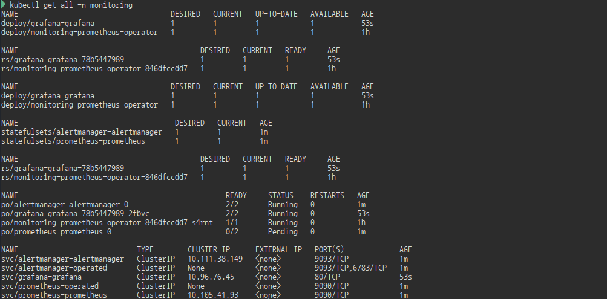
<!-- ```bash
# minikube vm의 memory가 부족해서 prometheus가 pending으로 나올수가 있는데 이런 경우, VM의 memory를 증가하고 다시 시작.
kubectl get all -n monitoring
```
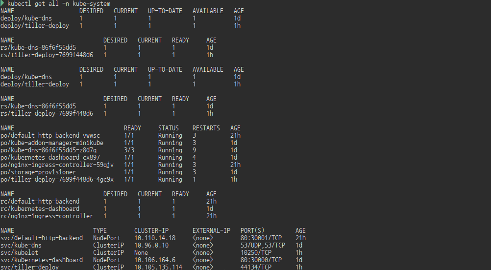
**exporter-node** 의 경우 /proc Filesystem에 접근을 해야 하기 때문에 securityContext에 privileged:true를 추가한다.
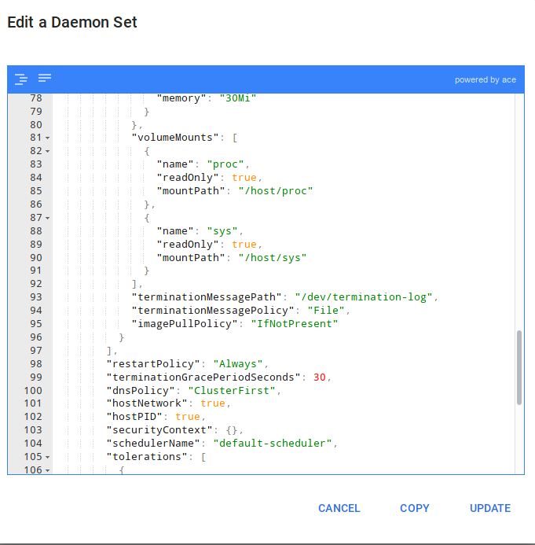 
  ```yml
  securityContext:
    privileged: true
  ```
  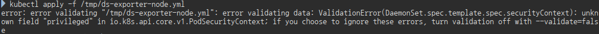
- minikube 실행 시 apiserver의 AllowPrivileged=true를 추가한다.
```bah
minikube start --extra-config=apiserver.Authorization.Mode=RBAC,apiserver.AllowPrivileged=true
``` -->

- Prometheus 
```bash
kubectl port-forward -n monitoring prometheus-prometheus-0 9090
```
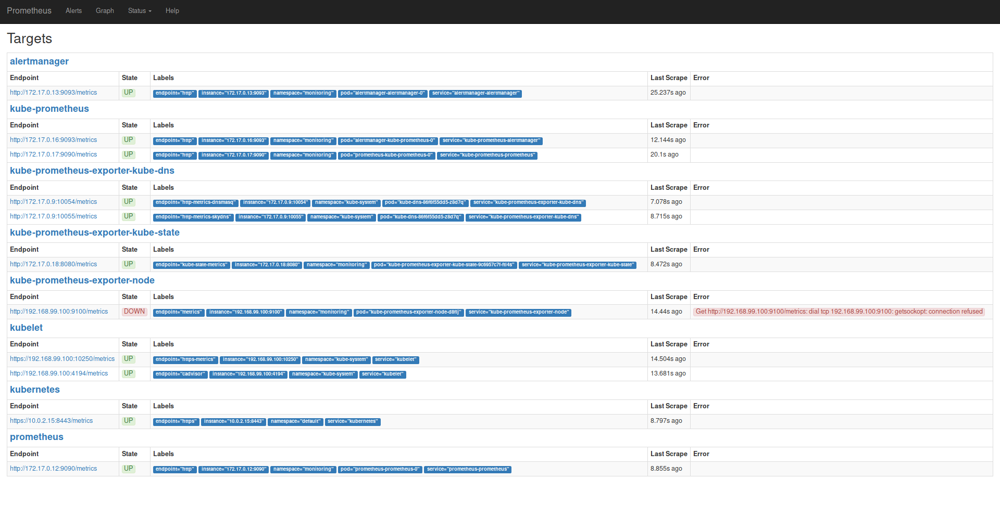

- grafana
```bash

# port-forward
kubectl port-forward -n monitoring $(kubectl get pods --selector=app=grafana-grafana -n monitoring --output=jsonpath="{.items..metadata.name}")  3000
```

<!-- ```bash
kubectl create -n kube-system tiller
kubectl create clusterrolebinding tiller --clusterrole cluster-admin --serviceaccount=kube-system:tiller
helm init --service-account tiller --tiller-namespace kube-system
```
**rbac-config.yml** for helm tiller service account for cluster-admin
```yml
apiVersion: v1
kind: ServiceAccount
metadata:
  name: tiller
  namespace: kube-system
---
apiVersion: rbac.authorization.k8s.io/v1beta1
kind: ClusterRoleBinding
metadata:
  name: tiller-binding
roleRef:
  apiGroup: rbac.authorization.k8s.io
  kind: ClusterRole
  name: cluster-admin
subjects:
  - kind: ServiceAccount
    name: tiller
    namespace: kube-system

/tmp/values.yml
```yml
prometheus:
  rbacEnable: false

exporter-kube-state:
  rbacEnable: false
```
```bash
helm install --name kube-prometheus --namespace=monitoring -f /tmp/values.yml coreos/kube-prometheus
```
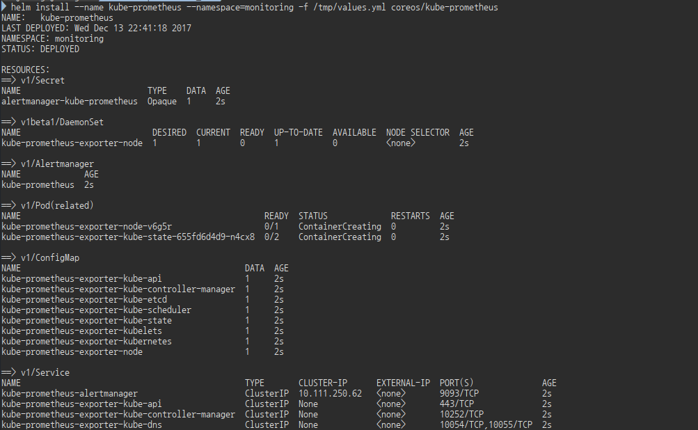
``` -->

# Infos
  - Kubernetes: https://kubernetes.io
  - "Prometheus" by Michael Kraus, ADMIN , issue 40, 2017, pg. 20, http://www.admin-magazine.com/Archive/2017/40/Time-series-based-monitoring-with-Prometheus
  - Example from the Kubernetes documentation: https://github.com/prometheus/prometheus/blob/master/documentation/examples/prometheus-kubernetes.yml
  - More about relabeling: https://www.robustperception.io/life-of-a-label/
  - PromQL: https://prometheus.io/docs/querying/basics/
  - Prometheus 2.0: https://coreos.com/blog/prometheus-2.0-storage-layer-optimization
  - Persistent volumes: https://kubernetes.io/docs/concepts/storage/persistent-volumes/
  - Stateful sets: https://kubernetes.io/docs/concepts/workloads/controllers/statefulset/
  - Minikube: https://github.com/kubernetes/minikube
  - Installing Minikube: https://github.com/kubernetes/minikube#installation
  - Listings for the article: ftp://ftp.linux-magazine.com/pub/listings/admin-magazine.com/41/
  - RBAC: https://github.com/prometheus/prometheus/blob/master/documentation/examples/rbac-setup.yml
  - Prometheus Docker image: https://hub.docker.com/r/prom/prometheus/
  - ConfigMap: https://kubernetes.io/docs/tasks/configure-pod-container/configmap/
  - Deployments: https://kubernetes.io/docs/concepts/workloads/controllers/deployment/
  - Node exporter image: https://hub.docker.com/r/prom/node-exporter/
  - DaemonSet: https://kubernetes.io/docs/concepts/workloads/controllers/daemonset/
  - Grafana: https://grafana.com
  - Node exporter dashboard: https://grafana.com/dashboards/22
  - Kubernetes pod dashboard: https://grafana.com/dashboards/737
  - Kubernetes dashboards: https://grafana.com/dashboards?dataSource=prometheus&search=Kubernetes
  - kube-state-metrics: https://github.com/kubernetes/kube-state-metrics
  - kube-state-metrics documentation: https://github.com/kubernetes/kube-state-metrics/tree/master/Documentation
  - Prometheus Operator: https://github.com/coreos/prometheus-operator
  - Prometheus Operator documentation: https://coreos.com/operators/prometheus/docs/latest/
