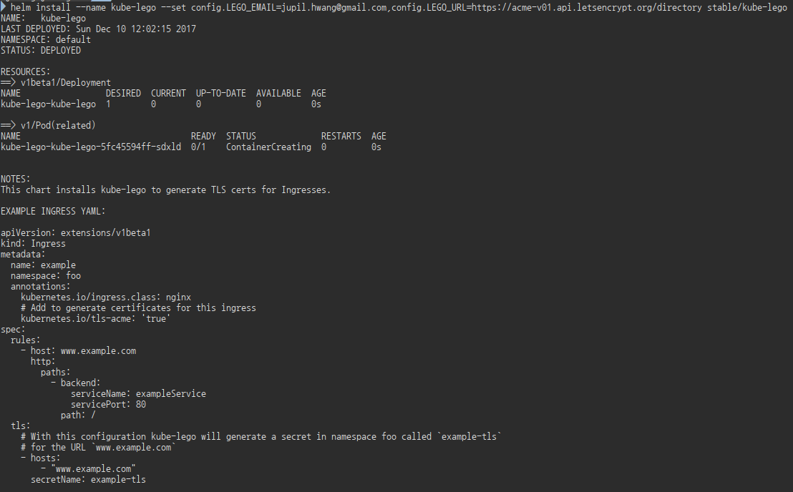

# Hands-on : Kubernetes

### Prerequisites
- Virtualbox
- minikube
- kubectl


### Kubernetes 101 (in 3min)
- Node : Master Node / Worker Node
- Pod :
- Service :
- Deployment :
- Ingress :

### Minikube Installation
참고 URL : [https://github.com/kubernetes/minikube]()

각 OS에 맞게 설치하면 됩니다.
##### Windows 사용자
Download the [minikube-windows-amd64.exe](https://storage.googleapis.com/minikube/releases/latest/minikube-windows-amd64.exe) file, rename it to minikube.exe and add it to your path.

##### Mac OS 사용자
```
brew cask install minikube
```
##### Linux 사용자
```
curl -Lo minikube https://storage.googleapis.com/minikube/releases/latest/minikube-linux-amd64 && chmod +x minikube && sudo mv minikube /usr/local/bin/
```

### Helm
Helm은 Kubernetes Package Manager이다. 크게 Client tool인 helm과 Server tool인 tiller로 구성된다

##### chart
Kubernetes에 탑재되는 Application을 이야기한다.
- [Chart](https://github.com/kubernetes/charts)
- [Kubeapps](https://kubeapps.com/)


##### tiller 설치
```bash
helm
```


### Kube-lego
Kube-Lego는 Kubernetes Ingress에서 Let's Encrypt인증서를 생성하고 자동으로 갱신해 주는 툴이다. Helm으로 설치가 가능하다

###### setup
```
helm init
```

##### install nginx-ingress
ingress를 설정하기 전에우선 ingress-controller를 설치해야 한다.

```
helm install --name nginx-ingress stable/nginx-ingress
```

##### install kube-lego
```
helm install --name kube-lego --set config.LEGO_EMAIL=jupil.hwang@gmail.com,config.LEGO_URL=https://acme-v01.api.letsencrypt.org/directory stable/kube-lego
```

```log
helm install --name kube-lego --set config.LEGO_EMAIL=jupil.hwang@gmail.com,config.LEGO_URL=https://acme-v01.api.letsencrypt.org/directory stable/kube-lego
NAME:   kube-lego
LAST DEPLOYED: Sun Dec 10 12:02:15 2017
NAMESPACE: default
STATUS: DEPLOYED

RESOURCES:
==> v1beta1/Deployment
NAME                 DESIRED  CURRENT  UP-TO-DATE  AVAILABLE  AGE
kube-lego-kube-lego  1        0        0           0          0s

==> v1/Pod(related)
NAME                                  READY  STATUS             RESTARTS  AGE
kube-lego-kube-lego-5fc45594ff-sdxld  0/1    ContainerCreating  0         0s


NOTES:
This chart installs kube-lego to generate TLS certs for Ingresses.

EXAMPLE INGRESS YAML:

apiVersion: extensions/v1beta1
kind: Ingress
metadata:
  name: example
  namespace: foo
  annotations:
    kubernetes.io/ingress.class: nginx
    # Add to generate certificates for this ingress
    kubernetes.io/tls-acme: 'true'
spec:
  rules:
    - host: www.example.com
      http:
        paths:
          - backend:
              serviceName: exampleService
              servicePort: 80
            path: /
  tls:
    # With this configuration kube-lego will generate a secret in namespace foo called `example-tls`
    # for the URL `www.example.com`
    - hosts:
        - "www.example.com"
      secretName: example-tls
```

---
### Prometheus Installation with Helm
```bash
helm repo add coreos https://s3-eu-west-1.amazonaws.com/coreos-charts/stable/

helm install coreos/prometheus --name prometheus
```
